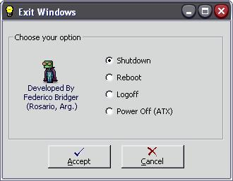



## A Shutdown, Restart, Reboot, Log off, Power off windows \(using ExitWindowsEx API\)

### Description

Exit windows using ExitWindowsEx API. This code will let you shutdown, reboot, log off and power off your from Windows 95/98/ME/NT/2000/XP.

Easy as it sounds, please vote if you like the app.
 
### More Info
 

             |
---                |---
**Submitted On**   |2003-05-20 12:08:28
**By**             |[Federico Bridger](https://github.com/Planet-Source-Code/PSCIndex/blob/master/ByAuthor/federico-bridger.md)
**Level**          |Intermediate
**User Rating**    |4.8 (115 globes from 24 users)
**Compatibility**  |VB 6\.0
**Category**       |[Miscellaneous](https://github.com/Planet-Source-Code/PSCIndex/blob/master/ByCategory/miscellaneous__1-1.md)
**World**          |[Visual Basic](https://github.com/Planet-Source-Code/PSCIndex/blob/master/ByWorld/visual-basic.md)
**Archive File**   |[A\_Shutdown1589925202003\.zip](https://github.com/Planet-Source-Code/federico-bridger-a-shutdown-restart-reboot-log-off-power-off-windows-using-exitwindowsex-a__1-45593/archive/master.zip)

